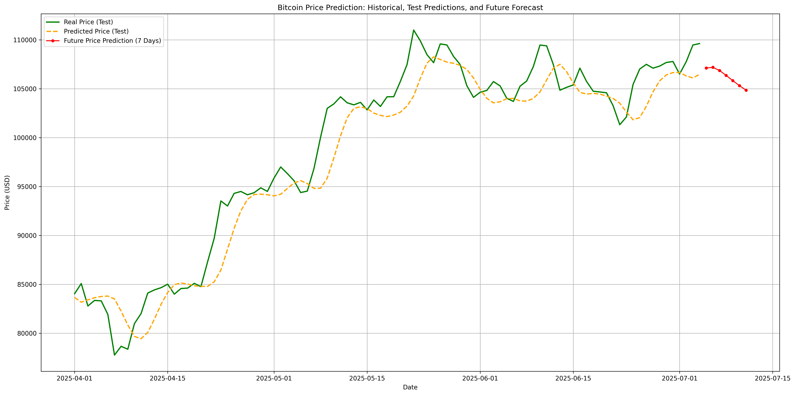

# Bitcoin Price Prediction with LSTM

## Описание проекта

Этот проект представляет собой исследование и реализацию модели **Long Short-Term Memory (LSTM)** для прогнозирования будущих цен на биткоин. LSTM — это тип рекуррентных нейронных сетей (RNN), особенно хорошо подходящий для задач, связанных с последовательными данными, таких как временные ряды. Цель проекта — продемонстрировать возможности LSTM в анализе и предсказании трендов криптовалютного рынка на основе исторических данных.

В текущей версии проект фокусируется на:
* Загрузке и предобработке исторических данных о ценах биткоина.
* Построении и обучении LSTM-модели.
* Визуализации прогнозов относительно реальных данных.

## Содержание репозитория

* `bitcoin_lstm_forecasting.ipynb`: Основной Jupyter Notebook, содержащий весь код для загрузки данных, предобработки, построения модели LSTM, обучения и визуализации результатов.

## Используемые технологии

* **Python**
* **TensorFlow / Keras:** Для построения и обучения нейронных сетей.
* **Pandas:** Для обработки и анализа данных.
* **NumPy:** Для численных операций.
* **Matplotlib:** Для визуализации данных и результатов.
* **Kagglehub** Для загрузки данных.

## Установка и запуск

Чтобы запустить этот проект локально, выполните следующие шаги:

1.  **Клонируйте репозиторий:**
    ```bash
    git clone [https://github.com/lsakovykh/bitcoin-price-prediction-lstm.git](https://github.com/lsakovykh/bitcoin-price-prediction-lstm.git)
    cd bitcoin-price-prediction-lstm
    ```
    
2.  **Создайте виртуальное окружение и установите зависимости:**
    Рекомендуется использовать `venv` или `conda` для управления зависимостями.
    ```bash
    # С использованием venv
    python -m venv venv
    source venv/bin/activate  # Для Linux/macOS
    # venv\Scripts\activate   # Для Windows
    pip install -r requirements.txt
    ```

3.  **Запустите Jupyter Notebook:**
    ```bash
    jupyter notebook bitcoin_lstm_forecasting.ipynb
    ```

## Примеры результатов

Ниже показан пример графика, демонстрирующего, как модель LSTM пытается предсказывать цены на биткоин.

